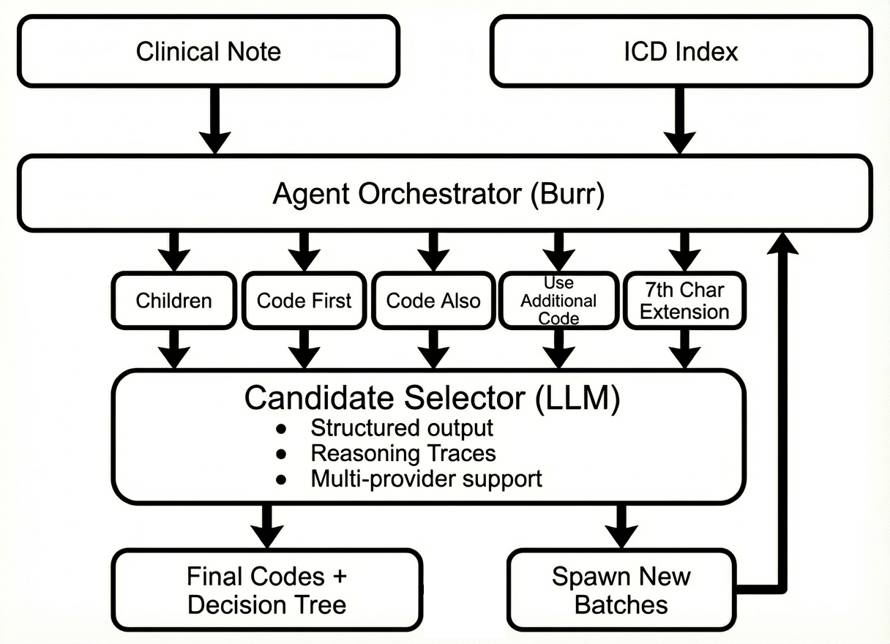

# Medstral

Agentic ICD-10-CM medical coding — paste a clinical note, get back standardized diagnosis codes.

Medstral uses a Mistral-powered agent that **walks the ICD-10-CM hierarchy** depth-first, selecting relevant codes at each level, fanning out in parallel, and collecting finalized codes at the leaves.

## Why stepwise traversal?

A single "zero-shot" LLM call can hallucinate codes that don't exist, miss lateral relationships (`codeFirst`, `codeAlso`), and can't explain *why* it picked a code. Stepwise traversal fixes all three problems:

1. **Grounded decisions** — at every node the LLM chooses only from real children loaded from the ICD-10-CM index, so hallucinated codes are structurally impossible.
2. **Lateral awareness** — the traversal automatically follows `codeFirst`, `codeAlso`, and `useAdditionalCode` edges, capturing codes a flat prompt would overlook.
3. **Self-optimizing** — each batch decision is cached by a SHA-256 key (note + model + temperature). Rewinding to any batch and re-traversing with a different instruction prunes the subtree and replays only the affected branches, so you refine results without re-running the whole tree.
4. **Transparent reasoning** — every batch records the LLM's reasoning and selected candidates, giving full auditability from chapter level down to 7th-character specificity.

## Architecture



State machine is built with [Burr](https://github.com/dagworks-inc/burr) and persisted to SQLite, so traversals survive restarts and identical requests are served from cache.

## Quickstart

### Prerequisites

- Python 3.10+
- Node.js 18+
- A [Mistral API key](https://console.mistral.ai/)

### 1. Clone and install

```bash
git clone <repo-url> && cd medstral

# backend
pip install -e .

# frontend
cd frontend && npm install && cd ..
```

### 2. Configure

```bash
cp .env.example .env   # then set MISTRAL_API_KEY
```

Or export directly:

```bash
export MISTRAL_API_KEY="your-key"
```

### 3. Run

**Full stack (recommended):**

```bash
# terminal 1 — backend
uvicorn server.app:app --host 0.0.0.0 --port 8000 --reload

# terminal 2 — frontend dev server
cd frontend && npm run dev
```

Open `http://localhost:5173`, paste a clinical note, and watch the traversal stream in.

**CLI only (no UI):**

```bash
python run.py                          # uses built-in sample note
python run.py "Patient presents with…" # your own note
```

### 4. Production build

```bash
# build the frontend into static files
cd frontend && npm run build && cd ..

# serve everything from FastAPI
uvicorn server.app:app --host 0.0.0.0 --port 8000
```

The backend serves the built frontend from `frontend/dist` automatically.

## API

| Endpoint | Method | Description |
|---|---|---|
| `/api/traverse/stream` | POST | Stream a traversal (SSE, AG-UI events) |
| `/api/traverse/rewind` | POST | Rewind to a batch and re-traverse |
| `/api/cache/invalidate` | POST | Clear LLM response cache |
| `/api/cache/clear-all` | POST | Clear all persisted state |

## Project structure

```
agent/
  actions.py      # Burr actions (load_node, select_candidates, finish)
  parallel.py     # fan-out parallel sub-tasks
  traversal.py    # state machine builder, cache keys, persistence
  llm.py          # Mistral API client (OpenAI-compatible)
  prompts.py      # prompt templates (scaffolded + zero-shot)
  zero_shot.py    # single-call mode (no traversal)
  benchmark.py    # precision / recall evaluation
server/
  app.py          # FastAPI + SSE streaming
  payloads.py     # request / response models
frontend/         # React 19 + Vite + Tailwind
static/
  icd10cm.json    # 47k-node ICD-10-CM hierarchy
```

## License

MIT
